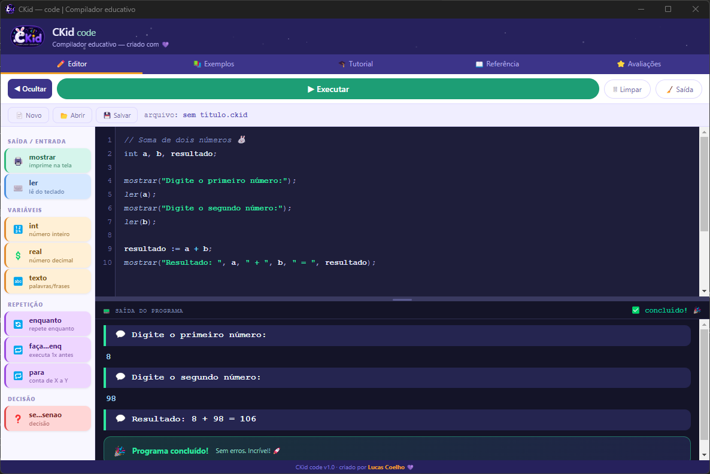
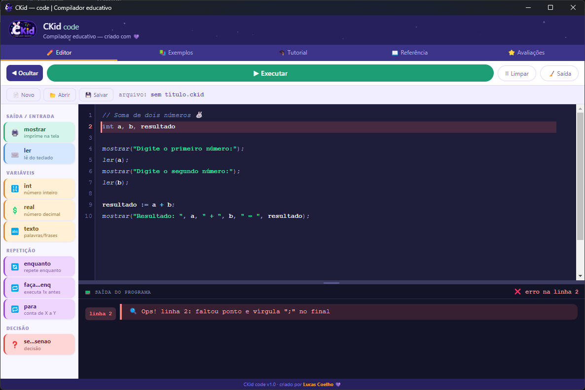

<div align="center">


# 🐰 CKid — code

**Compilador educativo feito para crianças aprenderem programação de verdade.**

[](https://github.com/lucascoelho/ckid-code/releases)
[](https://github.com/lucascoelho/ckid-code/releases)
[](#licença)
[](#)

[⬇ Baixar](#download) · [✨ Recursos](#recursos) · [🚀 Como usar](#como-usar) · [📸 Screenshots](#screenshots)

</div>

---

## O que é o CKid?

O **CKid code** é um compilador educativo com linguagem própria em português, criado para tornar o aprendizado de programação acessível e divertido. Com uma interface colorida, blocos de comandos clicáveis e mensagens de erro claras, qualquer criança consegue escrever seus primeiros programas.

---

## ✨ Recursos

- 🎨 **Highlight de sintaxe** — palavras-chave com cores vibrantes e legíveis
- 🧩 **Blocos prontos na sidebar** — clique para inserir comandos sem digitar
- 🔴 **Erros destacados** — linha com erro marcada em vermelho com mensagem clara
- 💾 **Salvar e abrir arquivos** — suporte a arquivos `.ckid`
- 📚 **Exemplos prontos** — tabuada, par ou ímpar, calculadora e mais
- ⭐ **Sistema de avaliações** — feedback dos usuários em tempo real (Firebase)
- 🖥️ **App desktop** — disponível como instalador `.exe` para Windows

---

## 📸 Screenshots

| Editor com código | Erro destacado |
|---|---|
|  |  |

---

## ⬇ Download

Acesse a página de [**Releases**](https://github.com/lucascoelho/ckid-code/releases) e baixe o instalador mais recente:

```
CKid code Setup 1.0.0.exe
```

> Compatível com **Windows 10 e 11** (64-bit). Não requer instalação de dependências.

---

## 🚀 Como usar

1. Baixe e execute o instalador `.exe`
2. Abra o CKid pelo atalho na área de trabalho ou menu iniciar
3. Escreva seu código na linguagem CKid (português)
4. Clique em **Compilar** e veja a saída na hora!

---

## 💻 Linguagem CKid

A linguagem do CKid é escrita em português e foi projetada para ser simples e intuitiva:

```
// Variáveis
inteiro idade := 10
texto nome := "Lucas"
real nota := 9.5

// Saída
mostrar "Olá, " + nome

// Entrada
ler idade

// Condicionais
se idade >= 18 {
  mostrar "Maior de idade"
} senão {
  mostrar "Menor de idade"
}

// Repetição
enquanto idade < 18 {
  idade := idade + 1
}

// Para
para i de 1 a 10 {
  mostrar i
}
```

---

## 🛠️ Desenvolvimento local

Para rodar o projeto localmente ou gerar o instalador:

**Pré-requisitos:** [Node.js](https://nodejs.org) 18+

```bash
# Instalar dependências
npm install

# Rodar em modo desenvolvimento
npm start

# Gerar instalador .exe
npm run build
```

O instalador será gerado na pasta `dist/`.

---

## 📁 Estrutura do projeto

```
ckid-electron/
├── main.js          ← processo principal do Electron
├── package.json     ← configurações e dependências
└── src/
    ├── index.html   ← app completo (HTML/CSS/JS)
    └── icon.ico     ← ícone do app
```

---

## 📄 Licença

© 2026 **Lucas Coelho** — Todos os direitos reservados.

Proibida a cópia, redistribuição ou uso comercial sem autorização prévia e por escrito do autor.

---

<div align="center">
Feito com 💜 por <strong>Lucas Coelho</strong>
</div>
